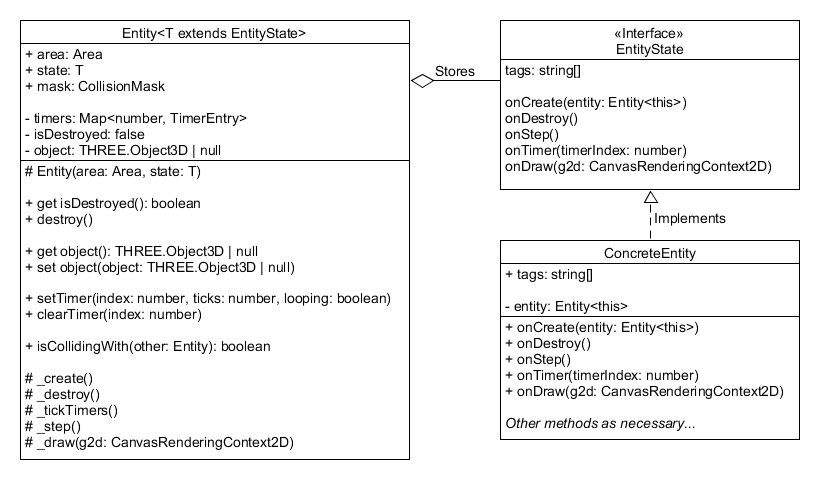

# 3D Game Engine

3D Game Engine written using [Three.js](https://threejs.org/)

 

## Game Engine Structure

The main structure of my game engine consists of 3 main classes:

- **Game** - Abstract data type for the entire game engine.
- **Area** - "Room", "Location", or "Level" inside a game. Every game must start in an area.
- **Entity** - Object that interacts in the game.

To actually create an `Area` or `Entity` in the engine, a class needs to implement the `AreaState` or `EntityState` interfaces respectively.
The concrete implementations are **stored** inside of the `state` property in areas and entities, meaning an Area is composed of an AreaState and an Entity is composed of an EntityState.
These state interfaces define several methods that need to be implemented:

- **onCreate(area/entity)** - Called once when the Entity or Area is first created
- **onDestroy()** - Called when an Entity is destroyed. Not found on the Area class.
- **onTimer(timerIndex)** - Called when a timer is fired.
- **onStep()** - Called on every game tick.
- **onDraw(graphics)** - Used to draw graphics to the game overlay. Meant for drawing UI elements, not actual game logic.

The `EntityState` interface also requires a public readonly property called `tags`, which is used to specify the collision groups in the game.
The Area class then exposes methods to search for an entity or a group of entities by tag.

The general idea with the engine is that an area creates the entities in the `onCreate()` method.
Then, the `onStep()` method in the entity handles things like keyboard events and collisions.
The `onTimer()` method is used for periodic events, like updating animations or cutscenes.
Finally, the `onDestroy()` method is used when an entity is removed from an area.
The `onDraw(graphics)` method is called every frame and is used by the Area and Entity classes to draw an overlay, or heads-up display (HUD).

There are also additional classes and interfaces to help with other aspects of the game:

- **InputManager** - Handles keyboard, mouse, and gamepad/controller input in the game.
- **AssetsManager** - Global storage for loaded textures, images, 3D models, and sounds.
- **ResourceManager** - Storage for "global" variables visible to all areas and entities.
- **CollisionMask** - Interface for handing collisions between entities in the game. The engine supports both axis-aligned bounding box (AABB) and spherical collisions.
- **LocalStorage** - Namespace of functions designed to encapsulate the browser's [Local Storage](https://developer.mozilla.org/en-US/docs/Web/API/Window/localStorage) features. This allows stored data to persist between browser sessions.
- **AudioWrapper** - Wrapper class around the THREE.js audio interface to make it easier for playing sounds.

For handing the 3D objects themselves, you should be familiar with [THREE.js](https://threejs.org/).
The game engine uses this library for all 3D rendering, so knowing how to use THREE.js is essential to manipulating 3D objects in the game.

 

## Game Class

The game object defines the abstract data type for the entire game engine.
This encapsulates all drawing, user input, and sound for a [HTML Canvas Element](https://developer.mozilla.org/en-US/docs/Web/API/HTMLCanvasElement).
In fact, since the game only depends on a canvas element, theoretically the engine can run multiple games on the same web page.
Constructing a new game requires two canvas elements: one to draw the 3D scene, and one to draw the overlay.
The overlay canvas should have a higher CSS z-index so it is drawn over the main canvas.
**All user input is attached to the overlay canvas, not the main canvas**, so both of these elements should be in the same position on the page for input to work correctly.

After constructing the game object, the game can actually be run by calling the `start(areaState)` method and passing an `AreaState` instance (not an Area instance).
Internally, this uses [Window.requestAnimationFrame()](https://developer.mozilla.org/en-US/docs/Web/API/window/requestAnimationFrame) for handling the game "ticks".
_The main event loop is explained later in this document._
The game can be stopped at any time by calling the `stop()` method, which disables this loop.

To transition to a new area, the game provides the `setArea(areaState)` method, which replaces the current area in the game.
Once again, this takes an `AreaState` instance, not an Area instance.
The current area can be retrieved by using the `.currentArea` getter property on the game object.
_Note that JavaScript now supports [Getter and Setter Functions](https://developer.mozilla.org/en-US/docs/Web/JavaScript/Reference/Functions#getter_and_setter_functions)._

The game also provides methods to get the absolute canvas size and overlay size in pixels.
By default, this size of the main canvas is set to the absolute size of the canvas in the web document.
However, a custom size can be specified using the `screenSize` property, which scales the main canvas drawing to match this size in pixels.
The size of the overlay canvas is handled by the `Area` class, not the game class.

Finally, the game delegates input handling, global assets, and global resources to the `InputManager`, `AssetsManager`, and `ResourceManager` classes respectively.
These are explained in more detail in the sections below:

### Input Manager

The `InputManager` class is responsible for all user input in the game engine.
Internally, it requires a canvas element for attaching the keyboard and mouse events.
_Recall from above that the InputManager uses the overlay canvas, NOT the main canvas._

This class exposes a series of methods to test for keyboard, gamepad, and mouse input.
All of the concrete keys and buttons are defined in the `Key`, `GamepadButton`, and `MouseButton` enums.
Additionally, gamepads have axes that can return a value from -1.0 to 1.0 (joysticks) or 0.0 to 1.0 (left and right triggers).
These axes are defined in the `GamepadAxis` enum.
Each connected gamepad has an index starting at 0, meaning the 0 gamepad can be treated as the "default" gamepad for most purposes.
Finally, the mouse input can retrieve information about the current xy position and xy movement of a mouse in the canvas.
Mouse movement **only** returns non-zero values if [Pointer Lock](https://developer.mozilla.org/en-US/docs/Web/API/Pointer_Lock_API) is enabled in the InputManager by setting the `pointerLockEnabled` flag to `true`.
Once enabled, the user must click the canvas to actually lock the pointer.
This feature is used by first-person shooter games to support mouse movement controls.

For keys and buttons, the following events are defined:

- **Started** - Fires once when the key or button is pressed in for the first time
- **Down** - Fired every game tick while the key or button is still being pressed down
- **Released** - Fired once when the key or button is first released

The InputManager has a variety of internal event handlers for managing all of these input events in the game engine.
Although shown in the diagram, these are not exposed publicly outside the game engine.

### Assets Manager

The `AssetsManager` class is responsible for loading and storing global game assets for the game engine.
Types of assets include:

- Textures and Cube Textures
- Audio Buffers
- Images
- THREE.js Objects (`THREE.Object3D instances`)
- Materials
- Animations

The class provides three main methods for each type of asset:

- **load(name, file)** - Load the asset from a file. Most loaders have a name field to specify what name to use for storing the asset.
- **save(name, asset)** - Store a loaded or created asset to a given name.
- **get(name)** - Get a loaded asset from a given name. Throws an exception if the asset is not found.

Internally, the AssetsManager uses the various THREE.js loaders for actually loading assets into the game.
Each loader method returns a [JavaScript Promise](https://developer.mozilla.org/en-US/docs/Web/JavaScript/Reference/Global_Objects/Promise) that can be used to wait for all assets to finish loading before starting the game.
Loading progress is printed to the console to help with debugging.

The AssetsManager class can also load objects from [gLTF](https://www.khronos.org/gltf/) files, making it easy to import models from 3D modeling software.
However, this load method requires a JavaScript callback instead of a name to handle the loaded file.
Since a single gLTF file can contain multiple objects, animations, and textures, this callback is responsible for saving the proper assets from the file.
The function is passed a reference of both the loaded gLTF file and the assets manager itself, then should call the various `save*(name, asset)` methods store the loaded components.
The same callback strategy is used for loading animations, which returns an array of animations that need to be individually saved by name.

### Resource Manager

The `ResourceManager` class is used for storing global state accessible by all areas and entities in the game.
This is useful for things such as a score counter, health bar, or player inventory.
Calling the `setResource(name, value)` stores a resource, and calling `getResource<T>(name, default?)` retrieves a resource.
The `getResource` method throws an exception if the resource does not exist, or it can be called with a default value to return instead of throwing an exception.
The ResourceManager also provides methods to delete a resource, test if a resource exists, and to clear all resources.
_Note: There is no type checking with the getResource() method, so the program assumes that T is the correct return type for a resource._

The `LocalStorage` namespace (not a class) exposes functions for working with the browser's [Local Storage](https://developer.mozilla.org/en-US/docs/Web/API/Window/localStorage).
This essentially serves the same purpose as the ResourceManager, but saved data persists between browser sessions.
This feature is useful for things like levels unlocked or a high score counter.
Since local storage only supports string values, all JavaScript objects are serialized to a string during storage and retrieval.
All functions in the LocalStorage namespace behave the same way as the ResourceManager class, including the `getObject<T>(name, default?)` which throws an exception if the name does not exists and a default value is not provided.

 

## Area Class

The Area class is the concept of a "level", "room" or "location" inside the game.
Areas themselves are constructed internally by the game engine, as concrete areas must implement the `AreaState` interface.
This state is then stored inside the Area object, meaning **an Area is composed of an AreaState, not a parent class of an AreaState**.

Each AreaState must implement the following methods:

- **onCreate(area)** - Called once when the area is first created
- **onTimer(timerIndex)** - Called when a timer is fired
- **onStep()** - Called on every game tick
- **onDraw(graphics)** - Draw any graphics to the game overlay

Notice that only the `onCreate(area)` method passes a reference of the wrapper area to the AreaState instance.
It is up to the concrete AreaState to store this reference internally if it wishes to access the Area methods and properties.

Each Area is linked with the parent game object, so you can read the `.game` property to retrieve the main Game instance.
Each Area stores a THREE.js scene, which contains all of the main 3D objects in the game.
Objects can either be added to the scene directly or associated with entities.
The Area also stores a single camera instance to use for rendering the scene, which can ge updated using the `.camera` getters and setters.
The camera may be statically created in an area or connected to an entity that moves.

An Area stores a set of Entity objects, which represent "objects" or "items" in the room.
A new entity can be created by calling the `createEntity(entityState)` method, which takes an `EntityState` instance (not an Entity instance).
This method constructs the Entity object internally using the EntityState instance.
All entities in the area can be retrieved by calling the `getAllEntities()` method.
Alternatively, entities can be searched for by the string tag using the `findEntities(tag)` and `findFirstEntity(tag)` methods.

The Area class has a built-in timer feature that can fire the `onTimer()` method after a given number of ticks.
To set a timer, use the `setTimer()` method. A timer can be a one-time event or a looped timer.
Each timer is indexed by an integer. Calling this method will replace any existing time left.
Use the `clearTimer()` method to stop a timer from firing.

Areas provide a THREE.js AudioListener along with the `createAudio` and `createPositionalAudio` methods to simplify sound creation.
The AudioListener instance is automatically linked with the area camera.
Each of the audio methods returns an `AudioWrapper` object, which vastly simplifies the THREE.js audio interface for playing sounds.

Finally, the Area object is responsible for specifying the overlay size in the game.
These properties are given by `overlayWidth` and `overlayHeight`.
On every frame, the overlay canvas is resized to match these parameters.
Having a fixed size makes it easier for the `onDraw(graphics)` methods for areas and entities to properly display the overlay.

The Area draws to the canvas elements the following order:

1. Main Canvas - 3D objects in THREE.js
2. Overlay Canvas - All Entity `onDraw()` methods in the area
3. Overlay Canvas - Area `onDraw()` method

The Area `onDraw()` method is the last thing drawn to the overlay, so it has the highest drawing priority.
As such, it can be used to implement features like heads-up displays or a score counter.

 

## Entity Class

The entity class represents a game object inside the scene, like a "player" or an "enemy" object.
Like the Area, entities themselves are constructed internally by the game engine, as concrete entities must implement the `EntityState` interface.
This state is then stored inside the Entity object, meaning **an Entity is composed of an EntityState, not a parent class of an EntityState**.

Each EntityState must implement the following methods:

- **onCreate(entity)** - Called once when the Entity is first created
- **onDestroy()** - Called when an Entity is destroyed
- **onTimer(timerIndex)** - Called when a timer is fired
- **onStep()** - Called on every game tick
- **onDraw(graphics)** - Used to draw graphics to the game overlay

Each Entity is linked with the parent area object, so you can read the `.area` property to retrieve the parent Area instance.
Notice that only the `onCreate(entity)` method passes a reference of the wrapper entity to the EntityState instance.
It is up to the concrete EntityState to store this reference internally if it wishes to access the Entity methods and properties.

Each Entity can store a THREE.Object3D instance, which represents a 3D model or a group of 3D models in the game.
This can be set and retrieved using the `.object` getters and setters.
The game engine automatically adds and removes this object from the scene when it is replaced or the entity is destroyed.
The Object3D can be mutated internally to have entities move around in the scene.

Entities can be removed from the area using the `destroy()` method.
The game engine will automatically remove the `.object` from the scene and call the `onDestroy()` method for the entity.
The `isDestroyed` getter can be used to test if an entity has already been destroyed.

Like with the Area class, the entity class has a built-in timer feature that can fire the `onTimer()` method after a given number of ticks.
To set a timer, use the `setTimer()` method. A timer can be a one-time event or a looped timer.
Each timer is indexed by an integer. Calling this method will replace any existing time left.
Use the `clearTimer()` method to stop a timer from firing.

Each Entity also stores a CollisionMask instance that can be used for collision detection between objects.
This mask is used internally by the `isCollidingWith(other)` method.
Collision masks themselves are explained later in the document.

Entities themselves do not provide any built-in mechanism for animations.
If you wish to animate your 3D models, you need use the [THREE.js Animation System](https://threejs.org/docs/?q=Animation#manual/en/introduction/Animation-system).
Preferably, you should call the `mixer.update(time)` in the `onStep()` handler for your entities.
Individual actions can be stored as properties inside the `EntityState`.

 

## Collision Mask

The game engine provides four types of collision masks that can be used to detect collisions between objects.
Each collision mask implements the `CollisionMask` interface.

- **BoxCollisionMask** - Implements axis-aligned bounding box (AABB) collision
- **SphereCollisionMask** - Implements spherical collision
- **GroupCollisionMask** - Check a group of collision masks as a single collision
- **EmptyCollisionMask** - Returns false for all collisions, placeholder mask

Each mask provides the `isCollidingWith(other)` that can test if two generic CollisionMask instances are overlapping.
This method works for all combinations of masks, including sphere-box collisions.
Other helper collision methods are also provided, such as `intersectsBox(box)`, `intersectsSphere(sphere)`, and `containsPoint(point)`.
The `update(object)` method can be used to automatically recompute the mask position from a THREE.Object3D instance.
The `intersectRay(ray)` method returns a vector pointing to the **closest point** where the collision masks overlap, or null if they do not overlap.
This is useful for ray tracing objects in the game using their collision masks.

Finally, each collision mask has the `showMask` flag. If set to true, the renderer draws a wireframe shape representing the mask in the scene.
Internally, this is handled by the `_drawMask(renderer)` method, which never needs to be called directly.
The game engine automatically removes this wireframe shape when the associated entity is destroyed or the flag is cleared.

 

## Other Classes

The `AudioWrapper` class provides a nice interface on top of the THREE.js [Audio](https://threejs.org/docs/?q=audio#api/en/audio/Audio) and [PositionalAudio](https://threejs.org/docs/?q=audio#api/en/audio/PositionalAudio) methods.
This class contains getter and setter methods for `.volume`, `.loop`, and `.isPlaying`.
The `play(looping?)` method automatically restarts the audio if it is not already playing.
The `stop()` method stops the audio if it is not playing.
These two methods prevent accidental exceptions with the THREE.js audio methods.

Finally, the `TimerEntry` class is used internally by the game engine to handle all of the timer events.
The `tick()` method returns true if the timer should be fired during the game tick. Otherwise, it returns false.

 

## Event Loop

The game engine runs the following event loop during each game tick:

1. Possibly switch to a new area and call the area `onCreate()` method
2. Tick all timers in the current area. If a timer fires, call the onTimer() handler for the area.
3. Call the `onStep()` method for the area.
4. Create all entities in the area, and call the `onCreate()` method on each entity
5. Destroy any entities marked to be destroyed, and call the `onDestroy()` method on each entity
6. Tick all timers for all entities in the current area. If a timer fires, call the `onTimer()` handler for that entity.
7. Call the `onStep()` method for all entities in the current area.
8. Render the area and overlay

The area is rendered in the following order:

1. Main Canvas - 3D objects in THREE.js
2. Overlay Canvas - All Entity `onDraw()` methods in the area
3. Overlay Canvas - Area `onDraw()` method
