# Trapped Inside

CSCI-43800 Spring 2021 - Final Project

Live demo running on [GitHub Pages](https://comprosoftceo.github.io/TrappedInside/) or [Itch.io](https://comprosoft.itch.io/trapped-inside)

<br />

## Game Engine Structure

This game has been written using my own 3D game engine, which I created for my Honors Project.
Check out the [Game Engine Documentation](Engine.md) to learn about the basic structure of the game engine.

<br/>

## Compiling and Running

Be sure you have [npm](https://docs.npmjs.com/downloading-and-installing-node-js-and-npm) installed to compile and run the source code.
You should be able to install both `nvm` and `npm` using the package manager on your Linux distribution.
Or, if you are on Windows, you can also run this project using [Windows Subsystem for Linux](https://docs.microsoft.com/en-us/windows/wsl/install-win10),
which runs a Linux distribution internally.

After cloning the repository, you will need to install all of the necessary dependencies by running:

```bash
npm install
```

The project uses [Webpack](https://webpack.js.org/) to bundle all of the code files together.
If you wish to run the project on your local computer, run:

```bash
npm start
```

Otherwise, you can build static files using the command:

```bash
npm run build
```

All output files will be in the `build/` directory, which can be hosted on a static website.

The source code is written using [TypeScript](https://www.typescriptlang.org/) to add static typing to JavaScript.
As such, it must be compiled and bundled by Webpack before it can be run by the browser.
[Babel](https://babeljs.io/) is used to transpile the JavaScript code to be compatible with older browsers.
This project also uses [ESLint](https://eslint.org/) and [Prettier](https://prettier.io/) to run static analysis on the code.

<br />

## Trapped Inside


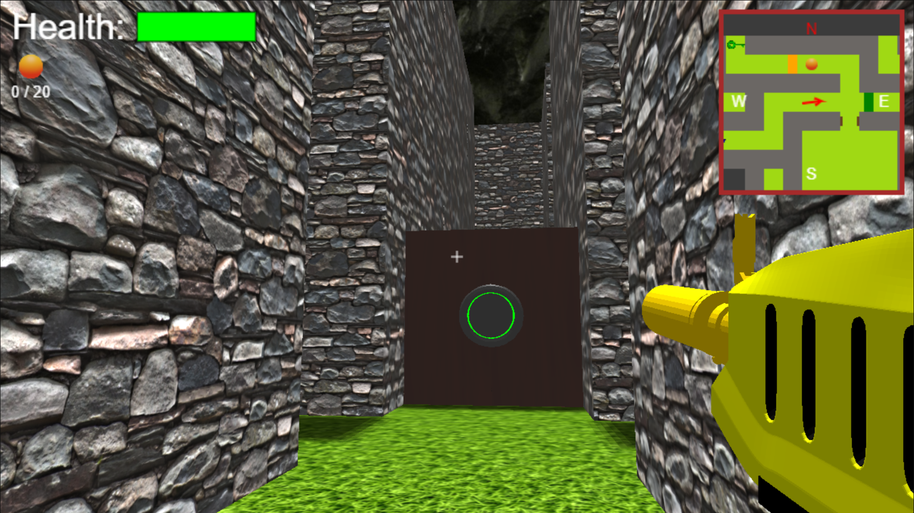

"Trapped Inside" is a first-person shooter game where you explore a 3D maze.
You collect items, like keys and batteries, to open doors and power electric boxes.
There are also levers that flip the state of doors in the maze.
Drone enemies wander around the maze and shoot at the player when in range.
To win the game, collect all of the energy balls and escape through the portal.
A live example of the game is hosted on [GitHub Pages](https://comprosoftceo.github.io/TrappedInside/) or [Itch.io](https://comprosoft.itch.io/trapped-inside).

**Keyboard and Mouse Controls:**

| Button     | Meaning                                  |
| :--------- | :--------------------------------------- |
| WASD       | Move the player (up, left, down, right)  |
| Mouse      | Control the camera direction             |
| E          | Interact with game elements (`Action: `) |
| Left Click | Shoot                                    |
| Space      | Hold to show the full map                |
| Enter      | Start game at title screen               |

**Gamepad Controls:**

| Button         | Meaning                                  |
| :------------- | :--------------------------------------- |
| Left Joystick  | Move the player (up, left, down, right)  |
| Right Joystick | Move the camera direction                |
| Left Trigger   | Zoom in camera for more precise aim      |
| Left Bumper    | Hold to show the full map                |
| Right Trigger  | Shoot                                    |
| A / Cross      | Shoot                                    |
| X / Square     | Interact with game elements (`Action: `) |
| Y / Triangle   | Hold to show the full map                |
| Start Button   | Start game on Title Screen               |

_Note: the Enter, Space, A, X, Y, Start, and Right Trigger buttons can be used to click buttons in the game (Like "Start" or "Restart")_

The heads-up display shows the player health, a small map of the maze, and any items collected in the maze.
It also lists the number of energy balls remaining to collect in the maze.
If you press and hold the Space, Left Bumper, or Y button, then you can view a larger map of the maze instead of the heads-up display.

Some of the cool features of this game include:

- Procedurally-generated mazes (_explained below_)
- Drone object that uses ray tracing to determine if it can see the player
- Map of the maze that updates as you explore
- Sunlight that changes the maze shadows as time advances
- Support for both keyboard-mouse and gamepad controls
- A variety of 3D objects with several animations
- Support for user interface elements
- Introduction and conclusion cutscenes

<br />

## Project Structure

The project is structured in an idiomatic way based on the game engine design.
The main entry point to the game is in `src/index.ts`.
All of the main game components are Areas, Entities, and Resources.

- **src/areas** - All game areas
- **src/engine** - Game engine components
- **src/entities** - All game entities
- **src/generator** - Random maze generator algorithm
- **src/resources** - Global game resources

Some of the entities are organized into subpackages to help keep things sorted:

- **src/entities/effects** - In-game effects, like the explosion or the fade-in / fade-out effect
- **src/entities/enemies** - Drone that flies around the maze
- **src/entities/maze-objects** - All elements in the maze, like keys, doors, levers, energy orbs, the portal, etc.
- **src/entities/ui** - User-interface components, such as buttons

The assets are structured as follows:

- **assets/images** - Icons used by the heads-up display
- **assets/levels** - Text files for storing the maze template and title screen layout
- **assets/music** - Ambient background music and sounds
- **assets/objects** - 3D models used in the game
- **assets/skybox** - Skybox texture for the background
- **assets/sounds** - Sound effects
- **assets/textures** - PRB image textures for the 3D objects

<br/>

## Game Areas

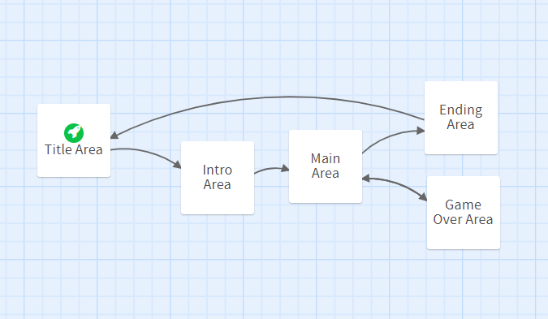

- **Title Scene** - Shows the game title and a play button
- **Intro Area** - Shows the introduction cutscene along with a "Skip" button
- **Main Area** - Maze that you explore in the game, handles the maze generation
- **Game Over Area** - Shown when you lose the level
- **Ending Area** - Shows the game ending cutscene

<br />

## Maze Elements

The various objects in the maze are explained in more detail below:

### Portal and Energy

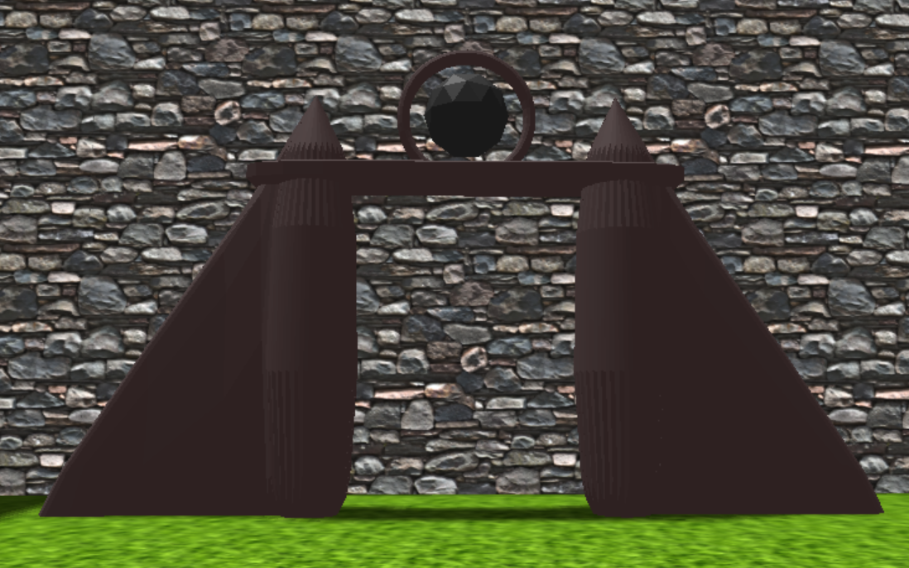

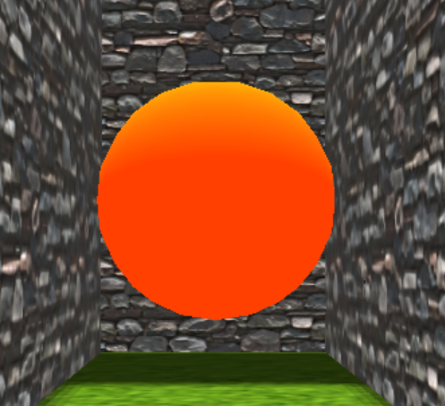

The portal door is the exit of the maze.
To activate the portal, you need to collect all of the energy scattered throughout the maze.
The activated portal is shown in the image below:

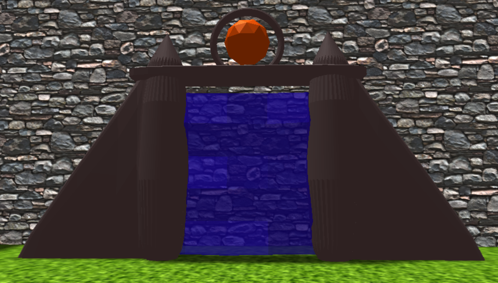

### Drone


The drone object moves around the maze and shoots at the player.
It uses ray tracing to determine if the player is visible around walls.
If the drone can see the player, then it rotates to point its face towards the player and shoot.
This behavior makes the drone a scary enemy to encounter in the maze.

Drone movement occurs in two steps:

1. **Rotation** - Pick a available direction to move, then rotate to face that direction
2. **Movement** - Move one tile forward, then go back to rotation

At each rotation step, the drone computes the available tiles in the maze that it is allowed to move to.
Unless there is only one direction available, the drone does not make a 180 rotation, meaning it is always moving forward in the maze.
This behavior is similar to how [PacMan ghosts behave](https://www.gamasutra.com/view/feature/3938/the_pacman_dossier.php?print=1).

### Doors and Keys

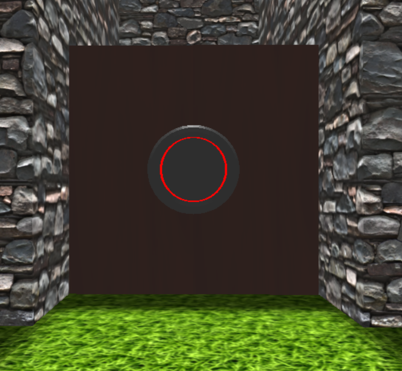

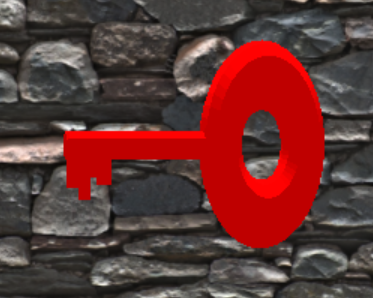

Colored keys can be collected throughout the maze to open colored doors. Each key opens exactly one door of the corresponding color.
Once the correct key is obtained, the door can be opened using the `E` key or `X` button when standing close to the door.
The maze has four door colors: red, yellow, green, and blue.

### Toggle Doors and Levers

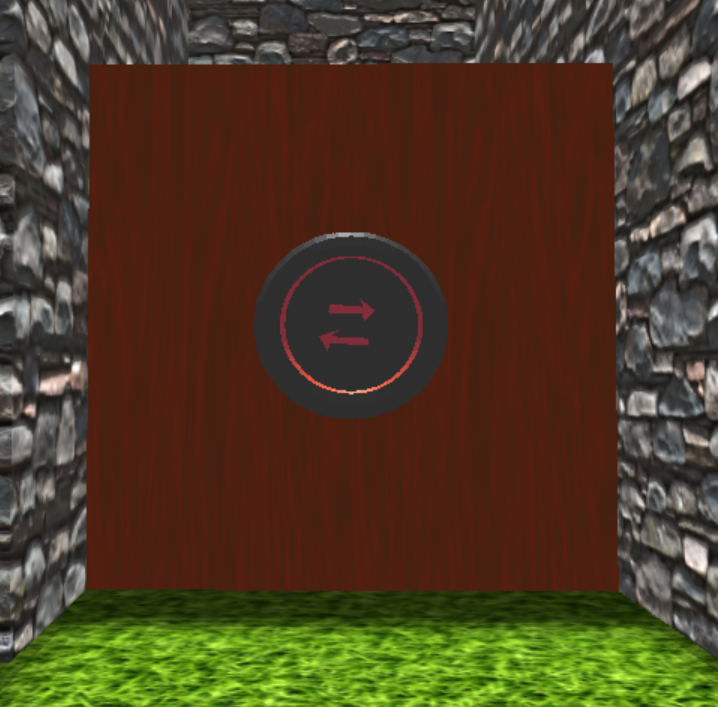

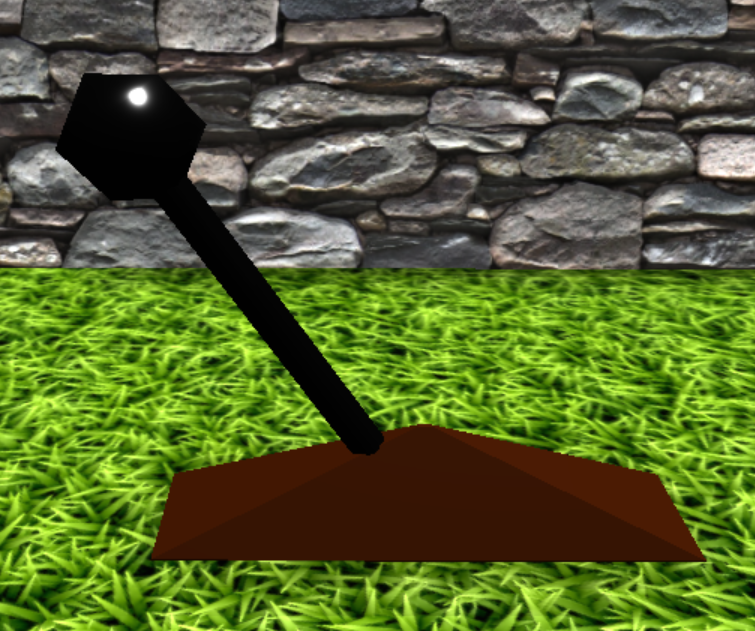

Pressing the lever changes the state of the toggle doors from open to closed and vice-versa.
Some toggle doors are open by default and some are closed by default.
The lever can be changed by pressing the `E` key or `X` button when standing close to it.

### Electric Door and Battery

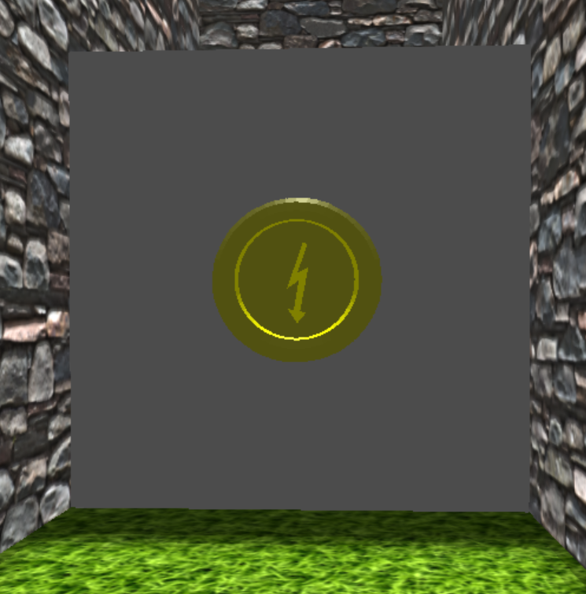

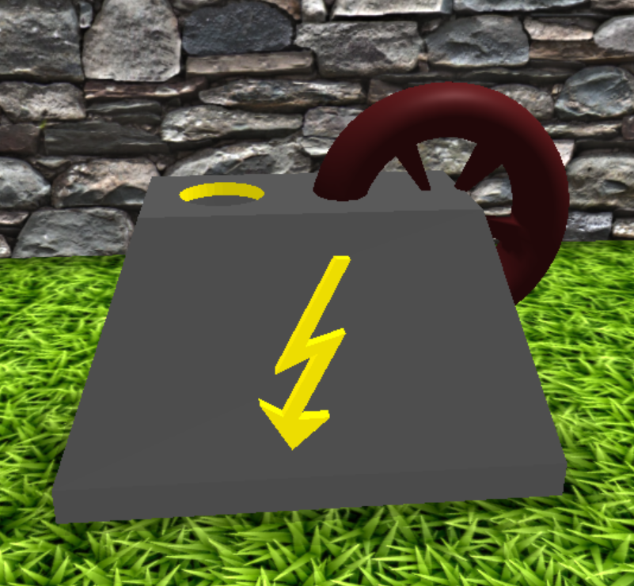

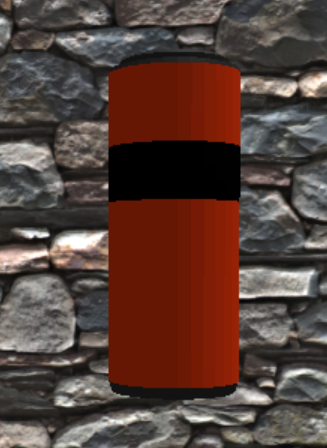

Opening the electric door requires you to put the battery inside the electric box.
Once you collect the battery, press the `E` key or `X` button when standing close to the electric box to insert the battery.
Press one of these buttons again to remove the battery from the electric box.
These two actions are shown in the diagrams below:

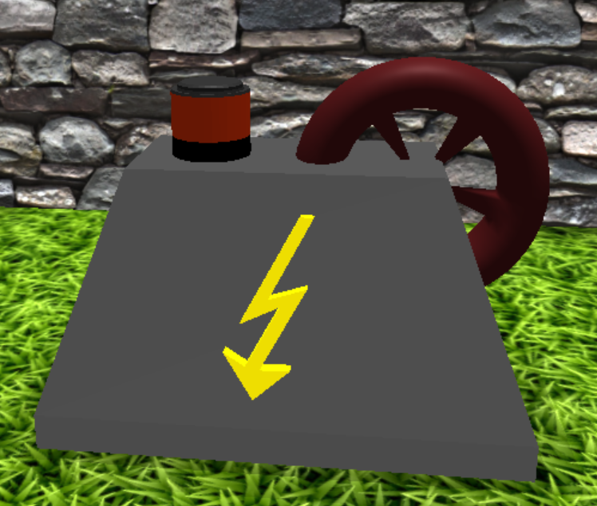

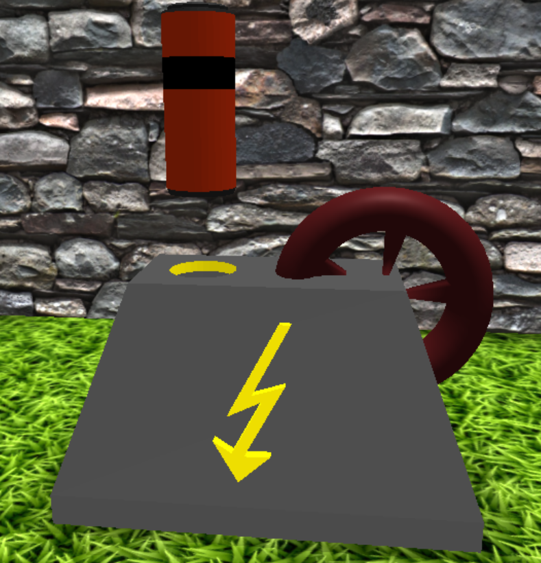

The game has three types of electric boxes, denoted `A`, `B`, `C`, which open door types `A`, `B`, and `C` respectively.
The game has no visual indicator to show these letters, so opening the correct electric door is done by trial-and-error.

### Rock

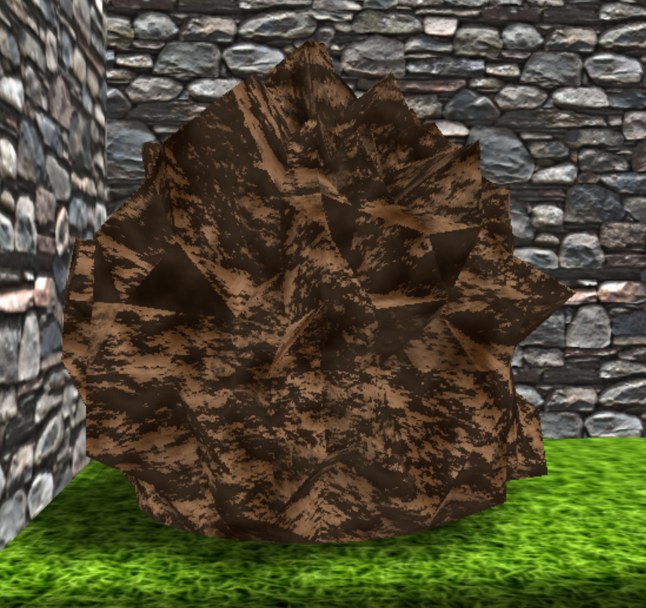

The rock doesn't require any special item to destroy.
Just shoot it several times, and it will explode.

### Gun

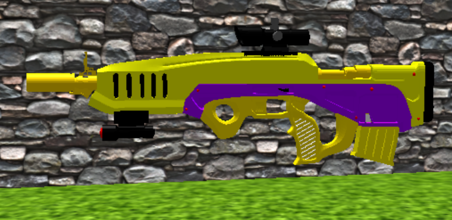

This item is collected at the start of the maze and allows the player to shoot.

### Map

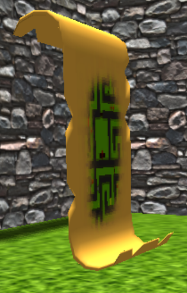

This item is collected at the start of the maze and tracks the maze layout as the player explores.

<br />

## Maze Generation Algorithm

The maze generation algorithm occurs in 6 main steps, which are detailed below:

_Disclaimer: Although I have done my best to ensure every maze is solvable, I cannot guarantee that the algorithm is perfect._
_Should an impossible maze be generated, just restart the game._
_However, I should note that every maze I have played has been solvable._

### Step 1 - Generate Walls

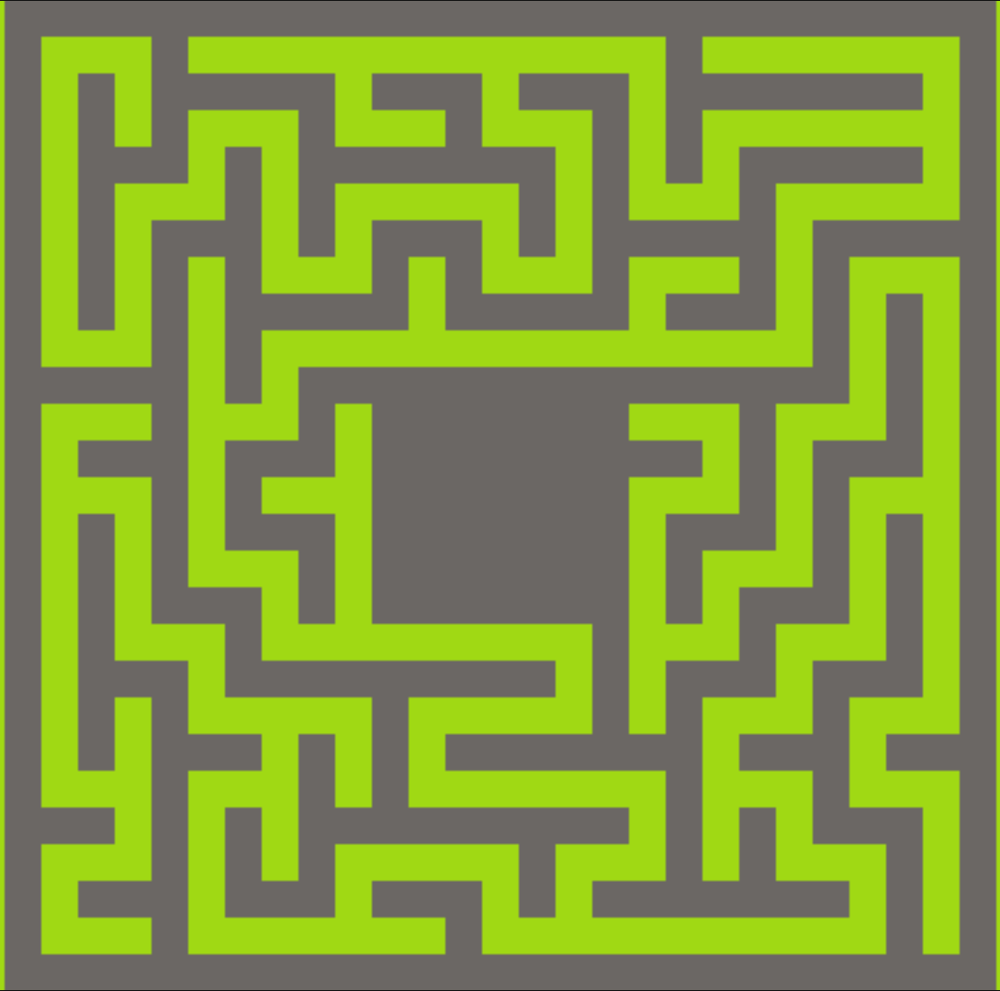

The first step of the algorithm generates a perfect maze layout.
This code is based on the [NPM Maze Package](https://www.npmjs.com/package/maze), but has been modified for this project to work with TypeScript.
This step leaves an empty area in the middle of the maze for putting the "template" layout (step 6).

### Step 2 - Generate Main Path

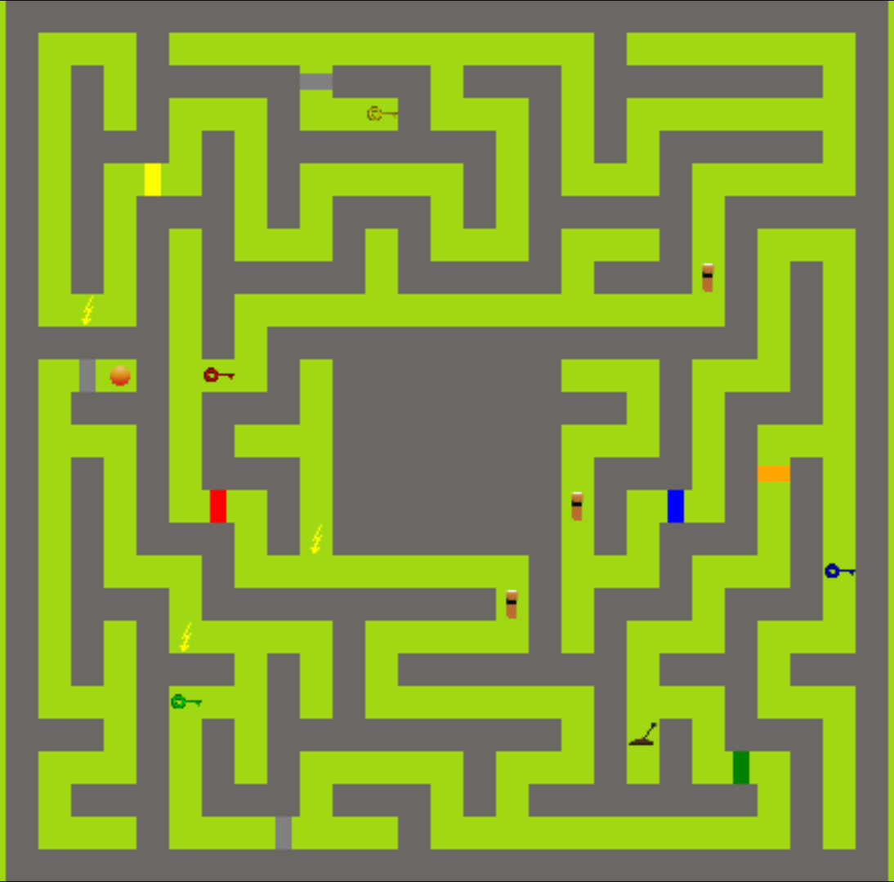

This step is the most crucial part of the maze generation process, as it generates the one true path through the maze.
In this step, the perfect maze is converted into a tree structure.
Each node in the tree stores two types of depth information:

- **Relative Depth** - The number of branches in the maze before this node
- **Absolute Depth** - Number of parent nodes

The main path algorithm basically works as follows:

1. Pick a random location for the door, and pick a random unused door type.
2. Pick a random location for the required item (or items) needed to the door.
3. Put another door in front of that item.
4. Repeat until no more door types remain.

_This algorithm also puts an energy ball behind the last door to ensure the game does not have an "empty" door in the maze._

The algorithm is guaranteed to use one of every door type in the game:

- Red, yellow, green, and blue colored doors
- Closed toggle door
- A, B, and C electric doors

When picking a location for the item, it cannot be a child of the door. Otherwise, the maze would be impossible.
Additionally, for the electric doors which require two items, only one of the two items receives a door.
Otherwise, the algorithm would get complicated with multiple branching paths.

In order to make sure doors and keys are distributed roughly "evenly" through the maze, the relative depth is used to pick the random locations.
The first door is placed in the highest depth, then the depth is shifted back by 1 in the maze after each iteration.
The window has a size of 5, meaning it can pick from the minimum depth to the minimum depth + 5.

### Step 3 - Generate Side Paths

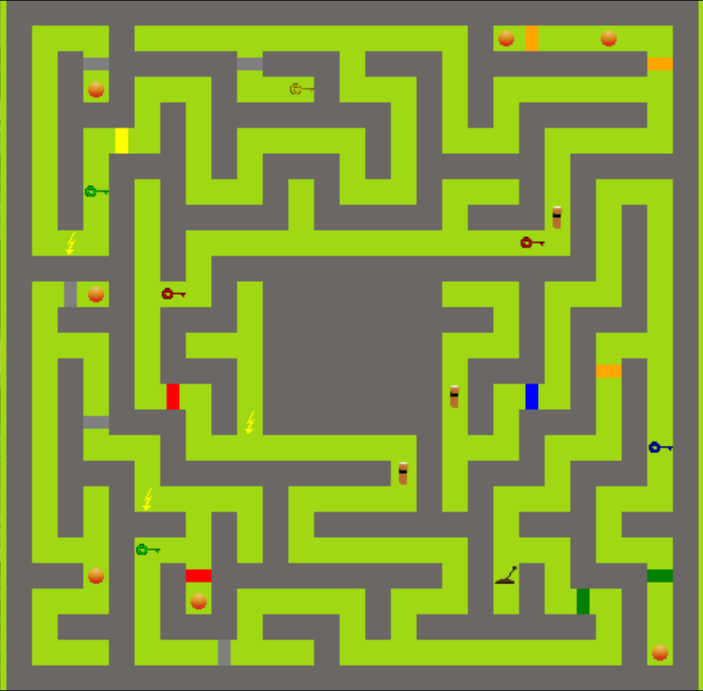

The main path is defined as all doors and items, as well as all their parent nodes, from the previous step.
Any node not in this main path is considered a side node.
To generate additional branching paths in the maze, the algorithm puts random doors in the side nodes.
Just like before, the algorithm always places an energy behind any side doors to ensure that there are no "empty" doors in the maze.
However, to ensure the maze is still solvable, the corresponding item is only allowed to be placed inside the main path.
This way, the side doors will not block any items to open other side doors.
Since we know the main path is perfectly solvable, we know that we can open all side doors as well.

There is one edge case that must be handled by this algorithm: colored doors.
A maze may become impossible if one key can open the side door when it should be used to open the main door.
To ensure this never happens, the maze only generates side colored doors behind the main path colored door.
That way, you must open the main colored door before you can open any side colored doors.

### Step 4 - Add Inverse Toggle Doors

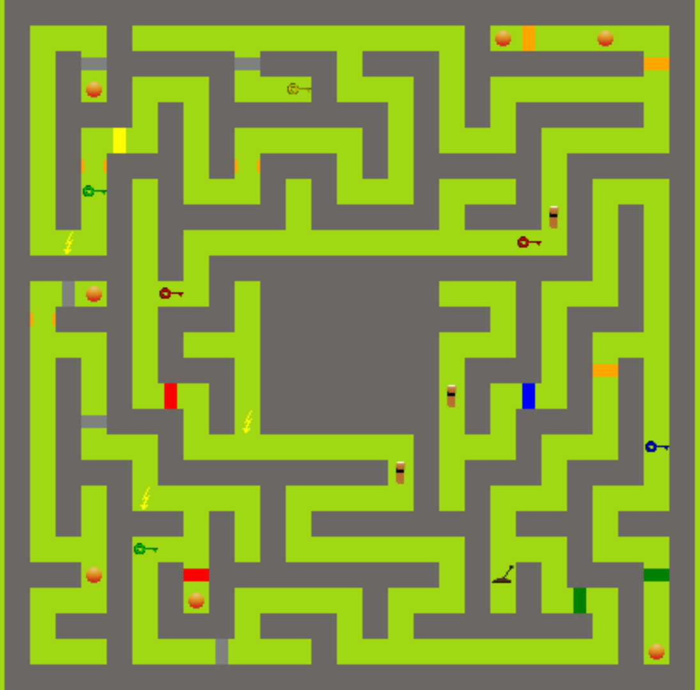

Inverse toggle doors are open by default, but close when the lever is flipped.
This special step adds a few inverse doors to make the maze more interesting.
These types of doors must be handled carefully or the maze may become impossible.
This can happen in one of two ways:

1. A normal toggle door in front of an inverse toggle door
2. An inverse toggle door in front of a normal toggle door

In both cases, it will be impossible to access the inside door because it will be blocked by the opposite door.
To ensure neither case can occur, the algorithm removes all nodes that are either:

1. Children of a normal toggle door
2. In the path between a normal toggle door and the lever

All of the remaining nodes are valid locations for the inverse toggle door.
This step adds one inverse toggle door for every normal toggle door as generated in the previous two steps.
Unlike the previous two steps, toggle doors do not add any energy balls into the maze.

### Step 5 - Add Other Items

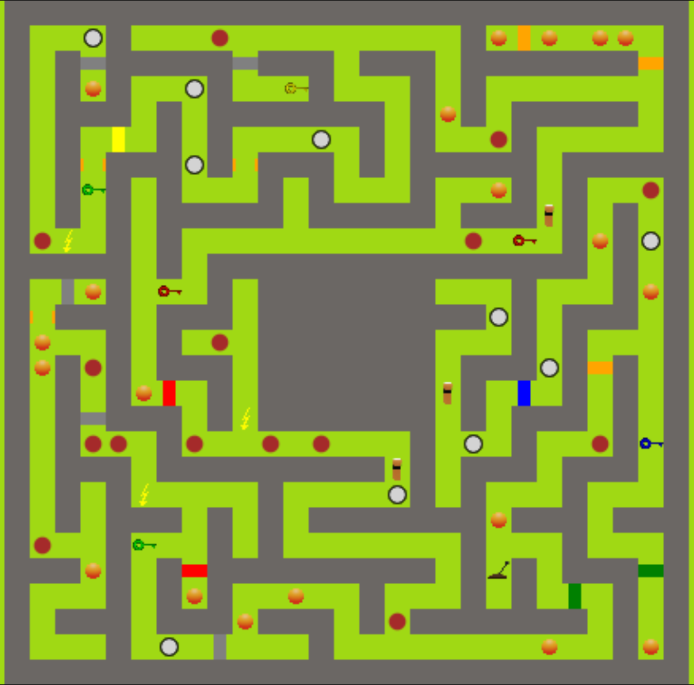

This step adds energy, drones, and rocks into the maze.
This is done by picking random vertices in the maze to place these remaining items.
The maze generation parameters specify the total number of each object to put in the maze.
If too much energy has been added by the previous 3 steps, then random energy balls are removed until the right amount of energy is left in the maze.

_It should be noted that this diagram shows rocks as brown circles, even though rocks are not shown on the map in the game._

### Step 6 - Add Template

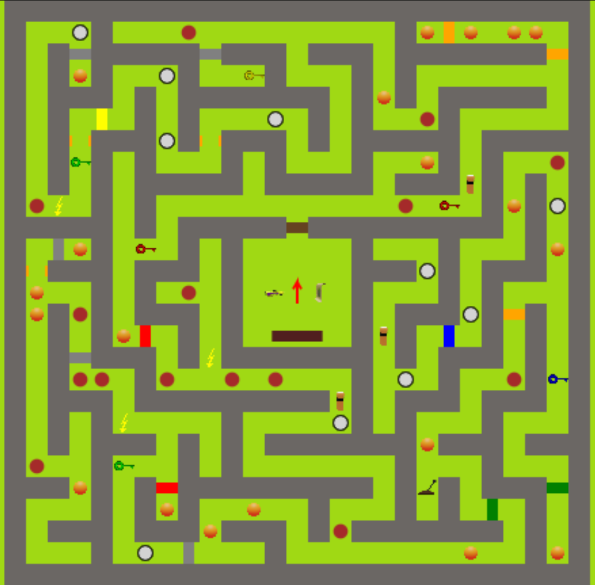

The last step is to add the center template to the maze.
This includes things like the location of the exit portal, the big door to start the maze, the gun, and the map item.
The maze generation algorithm is now complete!

<br />

## Asset Credits

All 3D models have been created by myself using Blender, except for:

- **Gun Model:** from [clara.io](https://clara.io/view/1d17cb12-fd85-4352-b055-4b05bffdd482).
- **Map Model:** from [clara.io](https://clara.io/view/7a66c324-9640-40a2-9bfc-959bf8f668b1).

The various textures are from:

- **Brick Texture:** from [3dtextures.me](https://3dtextures.me/2017/03/23/stone-wall-004/).
- **Grass Texture:** from [freepbr.com](https://freepbr.com/materials/stylized-grass1/).

The skybox is from [OpenGameArt.org](https://opengameart.org/content/forest-skyboxes) and has been created by Emil Persson (aka Humus).

The sound effects have all been generated using [jfxr](https://jfxr.frozenfractal.com/) with the following exceptions:

- **Electricity Noise:** from [OpenGameArt.org](https://opengameart.org/content/electricity-sound-effects), created by Erich Izdepski.
- **Door Opening Nose:** from [OpenGameArt.org](https://opengameart.org/content/rockmetal-slide), created by Hansjörg Malthaner.
- **Big Door Opening Nose:** from [OpenGameArt.org](https://opengameart.org/content/earthquake-and-open-sesame).
- **Enter Portal Nose:** from [OpenGameArt.org](https://opengameart.org/content/4-space-portal-sounds).
- **"Oof"** - Recorded by myself

The music and ambient sounds are from:

- **Title Music** - from [OpenGameArt.org](https://opengameart.org/content/dark-ambient-loop-13), created by Lucas Calvo.
- **Intro Music** - from [OpenGameArt.org](https://opengameart.org/content/ix).
- **Forest Sounds** - from [mixkit.co](https://mixkit.co/free-sound-effects/forest/).
- **Heart Monitor Sounds** - from [freesoundslibrary.com](https://www.freesoundslibrary.com/ekg-sounds/).
